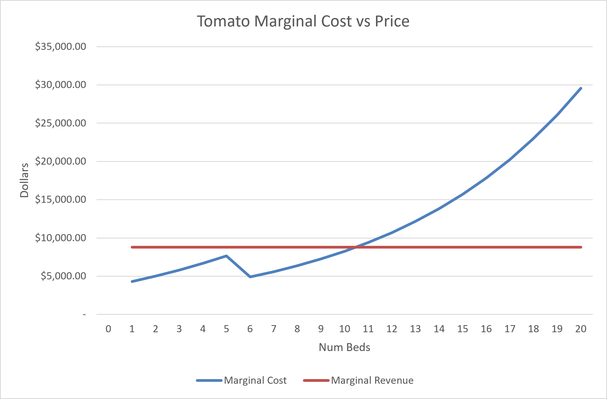
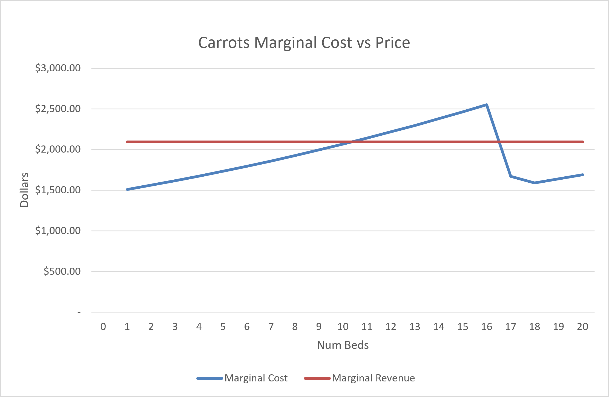
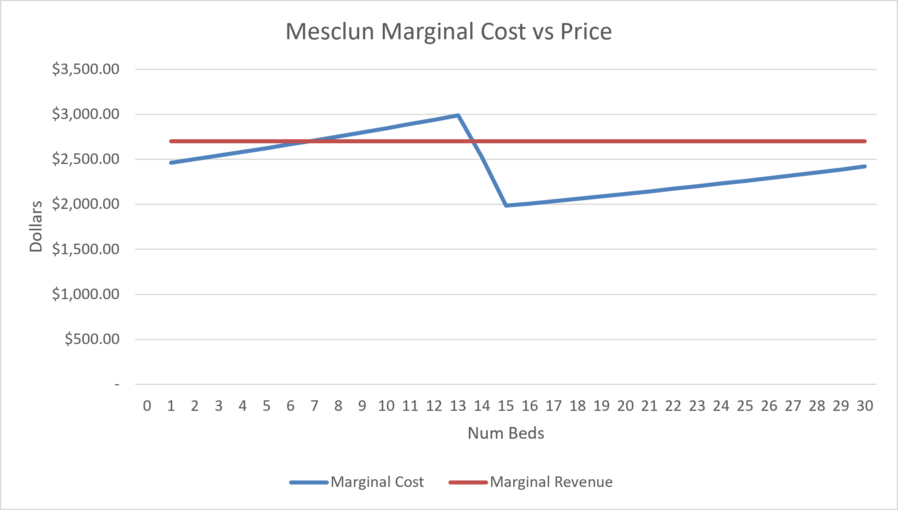

# Perfect Competition Analysis

## Why Tomato Production Stops at 10 Beds

**Figure 1. Tomato marginal cost versus market price.**

Tomato marginal cost crosses the market price between beds 10 and 11. At bed 10, marginal cost is approximately $8,249 which remains below the market price of $8,800. At bed 11, marginal cost increases to approximately $9,391, exceeding the market price. Because profit is maximized where price equals marginal cost, the optimizer selects approximately 10 tomato beds. Producing additional tomato beds beyond this point would add more cost than revenue and reduce overall profit.

## Binding Constraints and Shadow Prices
**Figure 2. Carrot marginal cost versus market price.**

**Figure 3. Mesclun marginal cost versus market price.**

The carrot and mesclun bed constraints are binding because production reaches the maximum allowable beds while marginal cost remains below market price. Figure 2 shows carrot marginal cost remains below price at the production limit, indicating additional carrot beds would still be profitable. Figure 3 shows the same pattern for mesclun. In contrast, the total-bed and labor constraints do not bind and therefore have no immediate economic value. The solution uses 60 of the 64 available beds and 3.16 of the 4 available temporary worker-equivalents, leaving 4 beds and 0.84 worker-equivalents of unused capacity. Because these constraints contain slack, their shadow prices are zero.

The shadow price for carrots is $352.49 per additional bed, while the shadow price for mesclun is $246.47 per additional bed. Since the carrot shadow price exceeds the mesclun shadow price by approximately $106 per bed, relaxing the carrot constraint would create the greater increase in farm profit and represents the preferred expansion opportunity.

## The Tomato Marginal Cost Dip

Figure 1 shows an unusual decline in tomato marginal cost between beds 5 and 6. Marginal cost falls from approximately $7,660.86 at bed 5 to $4,906.28 at bed 6 before rising again at higher output levels. The decline does not occur because diminishing returns disappear. Instead, the labor source changes. The farm exhausts the farmer's available field hours and begins using lower-cost temporary labor. For a short range of production, the lower wage rate more than offsets the additional hours required, causing marginal cost to fall. As production continues, diminishing returns again become the dominant force and marginal cost resumes increasing. This illustrates that marginal cost is affected both by production efficiency and by changes in input prices.

## The Carrots MR Intersections

Figure 2 shows MC intersecting the MR line at around 11 beds on the upward-sloping portion of the curve and again near 17 beds on the declining portion. Between these two intersections, marginal cost exceeds marginal revenue, making additional beds unprofitable. After the second intersection, marginal cost falls below price once again and additional beds become profitable. This second crossing occurs because the farm exceeds the farmer's 720-hour labor allocation between beds 16 and 17, causing production to shift to lower-cost temporary labor. The resulting reduction in labor cost creates the same marginal-cost notch observed in the tomato analysis.

## The Mesclun MR Intersections

Figure 3 shows MC intersecting the MR line at approximately 7 beds on the upward-sloping portion of the curve and again near 14 beds on the declining portion. Between the two intersections, marginal cost exceeds marginal revenue and additional beds reduce profit. After the second crossing, marginal cost again falls below price. This occurs because the farm exceeds the farmer's available labor hours between beds 13 and 14 and begins utilizing lower-cost temporary labor. The resulting decrease in labor cost creates the same second-intersection pattern observed in both the carrot and tomato analyses.

## Why Grow Crops That Lose Money Individually

Although individual crop plans may not cover the entire $20,000 of fixed costs on their own, the decision to plant additional beds depends on marginal cost and average variable cost rather than fixed cost. Fixed costs are incurred regardless of production decisions and therefore should not determine short-run output. Each additional profitable bed contributes toward covering fixed costs that the farm must pay anyway. As long as market price exceeds average variable cost, production remains economically rational even when a single crop appears unprofitable when evaluated in isolation. For carrots at 20 beds, average variable cost equals $1,918.45, which remains below the market price of $2,094. For mesclun at 30 beds, average variable cost equals $2,430.74, which remains below the market price of $2,700. Because price exceeds average variable cost in both cases, production remains economically rational in the short run even though fixed costs may prevent the crops from appearing profitable when evaluated independently. Interestingly, mesclun average variable cost exceeds market price around beds 13 and 14, which corresponds to the same region where the marginal-cost intersections occur.

## Comparison Against My Original Hypothesis

My original hypothesis was that the profit-maximizing solution would fully utilize carrots and mesclun capacity limits while allocating approximately 10 beds to tomatoes. The hypothesis was supported by the results of the optimization model. Although the overall planting mix was correct, I initially focused on revenue potential rather than the interaction between marginal cost, constraints, and shadow prices. The model demonstrated that profitability depends on marginal analysis rather than simply selecting the crop with the highest revenue per bed.
