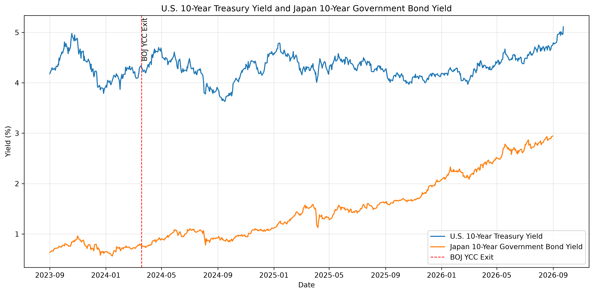
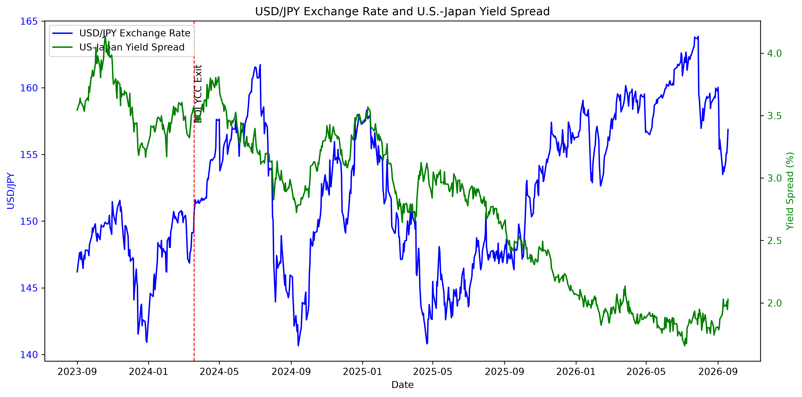
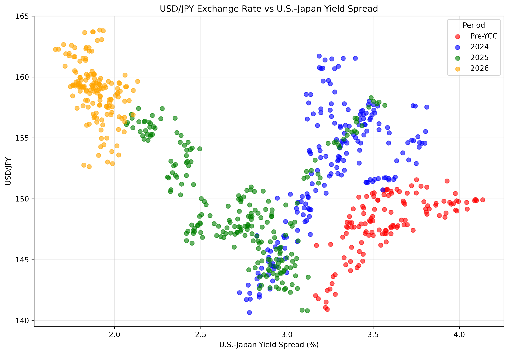

# Research Paper Draft 2

Date: 2026-10-01

## Working Title

Has the Bank of Japan Regained Control of Japanese Interest Rates?

## Research Question

Has the Bank of Japan regained control of Japanese interest rates following the end of Yield Curve Control, or do Federal Reserve policy decisions continue to exert greater influence on Japanese financial conditions?

## Preliminary Finding

The event-study results do not support the hypothesis that Federal Reserve announcements generate larger Japanese government bond yield reactions than Bank of Japan announcements. Post-exit average absolute JGB movements were larger around BOJ policy events than around Federal Reserve events.

## Background

Japan is the largest foreign holder of U.S. Treasury securities and maintains one of the world's largest sovereign debt markets. Because Japanese investors actively allocate capital across global fixed-income markets, changes in U.S. monetary policy may influence Japanese interest rates and exchange rates even after domestic policy normalization.

The question became more important after the Bank of Japan ended Yield Curve Control and began raising interest rates. If Japanese yields continue to respond primarily to Federal Reserve actions, Japan's monetary independence may remain limited despite policy normalization.

## Methodology

This study evaluates market reactions to major Federal Reserve and Bank of Japan policy announcements between September 2023 and September 2026.

Three financial series were analyzed:

- U.S. 10-Year Treasury Yield
- Japan 10-Year Government Bond Yield
- USD/JPY Exchange Rate

Event windows were measured using the nearest available trading days surrounding each policy announcement date. Yield changes were calculated using the change from t-1 to t+1.

The BOJ exit from Yield Curve Control on 2024-03-19 was treated as the structural-break event itself and excluded from both the pre-exit and post-exit samples.

## Results

### U.S. and Japanese Government Bond Yields

Figure 1 compares U.S. Treasury yields and Japanese government bond yields over the study period.

The data show that both markets experienced rising yields after 2024, although U.S. Treasury yields remained substantially higher throughout the sample.

### USD/JPY and Yield Differentials

Figures 2 and 2B compare the USD/JPY exchange rate with the U.S.-Japan yield spread.

The figures suggest a relationship between interest-rate differentials and exchange-rate movements, though the relationship varies across time periods.

### Event Study Results

Post-exit average absolute JGB movements were:

- BOJ announcements: 3.02 basis points
- Federal Reserve announcements: 2.60 basis points

The difference between the two groups was -0.42 basis points.

The predefined hypothesis required Federal Reserve reactions to exceed BOJ reactions by at least 5 basis points.

That condition was not met.

## Interpretation

The results do not support the claim that Federal Reserve announcements exert greater influence on Japanese government bond yields than Bank of Japan announcements following policy normalization.

Instead, BOJ announcements generated slightly larger average JGB reactions during the post-exit period.

The difference was small, suggesting that both central banks continue to influence Japanese financial conditions.

## Preliminary Recommendation

Because no economically meaningful Federal Reserve advantage was observed, corporate treasurers should monitor both Federal Reserve and Bank of Japan policy announcements when assessing Japanese interest-rate risk.

Additional analysis is needed before determining whether policy influence differs across bond yields, exchange rates, and broader financial markets.

## Open Questions

- How large is a typical two-day JGB move relative to the observed event-study differences?
- Do exchange-rate reactions show a different pattern from bond-yield reactions?
- Does extending the sample period change the relative importance of BOJ and Federal Reserve announcements?
