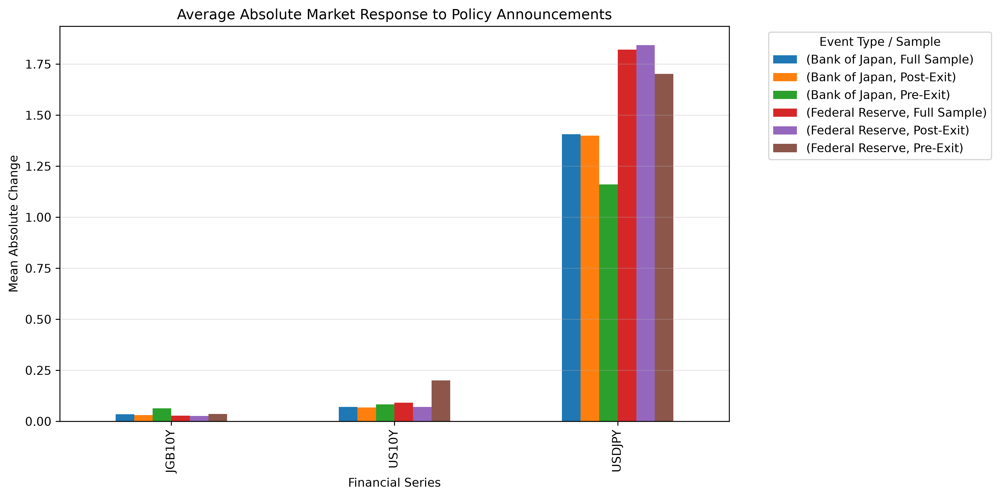

# Has the Bank of Japan Regained Control of Japanese Interest Rates?

**Wade Okumura**

BUS 620: Micro and Macro Economics

Individual Research Paper

October 8, 2026

## Research Question

Has the Bank of Japan regained control of Japanese interest rates following the end of Yield Curve Control, or do Federal Reserve policy decisions continue to exert greater influence on Japanese financial conditions?

## Finding

The event-study results do not support the hypothesis that Federal Reserve announcements generate larger Japanese government bond yield reactions than Bank of Japan announcements. Post-exit average absolute JGB movements were larger around BOJ policy events than around Federal Reserve events.

## Background

Japan is the largest foreign holder of U.S. Treasury securities and maintains one of the world's largest sovereign debt markets (U.S. Department of the Treasury, 2026). Because Japanese investors actively allocate capital across global fixed-income markets, changes in U.S. monetary policy may influence Japanese interest rates and exchange rates even after domestic policy normalization.

The question became more important after the Bank of Japan ended its Quantitative and Qualitative Monetary Easing framework with Yield Curve Control and shifted to guiding the short-term interest rate as its primary policy tool (Bank of Japan, 2024). If Japanese yields continue to respond primarily to Federal Reserve actions, Japan's monetary independence may remain limited despite policy normalization.

## Methodology

This study evaluates market reactions to major Federal Reserve and Bank of Japan policy announcements between September 1, 2023, and September 18, 2026.

Three financial series were analyzed:

- U.S. 10-Year Treasury Yield
- Japan 10-Year Government Bond Yield
- USD/JPY Exchange Rate

The U.S. 10-year Treasury yield and USD/JPY exchange rate were obtained from the Federal Reserve Bank of St. Louis FRED database using series DGS10 and DEXJPUS, respectively. Daily Japanese government bond yield data were obtained from the Japan Ministry of Finance (Board of Governors of the Federal Reserve System, 2026a, 2026b; Japan Ministry of Finance, 2026).

Event windows were measured using the nearest available trading days surrounding each policy announcement date. Yield changes were calculated using the change from *t*−1 to *t*+1. The Bank of Japan's March 19, 2024, policy-framework change was treated as the structural-break event itself and excluded from both the pre-exit and post-exit samples (Bank of Japan, 2024).

The event calendar contains 25 Federal Reserve announcements and 25 Bank of Japan announcements. Complete JGB event windows were available for all 25 Federal Reserve announcements and 24 Bank of Japan announcements. The Bank of Japan's March 19, 2024 policy-framework change was treated as the structural break and excluded from the pre-exit and post-exit comparison, leaving 4 pre-exit and 19 post-exit BOJ observations for the JGB analysis.

## Results

### U.S. and Japanese Government Bond Yields

**Figure 1. U.S. 10-Year Treasury Yield and Japan 10-Year Government Bond Yield, September 2023–September 2026.**  
*Sources: Board of Governors of the Federal Reserve System via FRED (DGS10); Japan Ministry of Finance.*

Figure 1 compares U.S. Treasury yields and Japanese government bond yields over the study period. The data show that both markets experienced rising yields after 2024, although U.S. Treasury yields remained substantially higher throughout the sample.

### USD/JPY and Yield Differentials

**Figure 2. USD/JPY Exchange Rate and U.S.–Japan 10-Year Yield Spread, September 2023–September 2026.**  
*Sources: Board of Governors of the Federal Reserve System via FRED (DGS10 and DEXJPUS); Japan Ministry of Finance.*

**Figure 2B. USD/JPY Exchange Rate and U.S.–Japan 10-Year Yield Spread by Policy Period.**  
*Sources: Board of Governors of the Federal Reserve System via FRED (DGS10 and DEXJPUS); Japan Ministry of Finance.*

Figures 2 and 2B compare the USD/JPY exchange rate with the U.S.-Japan yield spread. The figures suggest a relationship between interest-rate differentials and exchange-rate movements, though the relationship varies across time periods.

### Event Study Results

Post-exit average absolute JGB movements were:

- BOJ announcements: 3.02 basis points
- Federal Reserve announcements: 2.64 basis points

The difference between the two groups was −0.38 basis points. The predefined hypothesis required Federal Reserve reactions to exceed BOJ reactions by at least 5 basis points. That condition was not met.

**Figure 3. Post-Exit Average JGB10Y Response to BOJ and Federal Reserve Announcements.**
*Source: Author calculations using Federal Reserve and Bank of Japan event windows.*

Figure 3 compares average post-exit Japanese government bond yield reactions following Bank of Japan and Federal Reserve policy announcements. Average absolute yield movements measured 3.02 basis points following BOJ announcements and 2.64 basis points following Federal Reserve announcements. The estimated difference of −0.38 basis points falls well below the study's 5-basis-point threshold for practical significance, resulting in a verdict of "Not Supported."

## Interpretation

The USD/JPY results indicate that interest-rate and currency risks do not respond identically to Federal Reserve and Bank of Japan announcements. In the post-exit period, average absolute USD/JPY movements were 1.84 yen around Federal Reserve announcements and 1.40 yen around BOJ announcements. Although BOJ events produced slightly larger average movements in Japanese government bond yields, Federal Reserve events produced larger average movements in the exchange rate. For corporate treasurers, this difference suggests that monitoring priorities should depend on the exposure being managed: BOJ announcements may warrant somewhat greater attention for Japanese interest-rate exposure, while Federal Reserve announcements remain especially relevant for USD/JPY currency exposure.

The larger average JGB movement around BOJ announcements does not, by itself, establish that the Bank of Japan has regained control of Japanese interest rates. An event study measures the magnitude of market reactions but does not determine whether those reactions reflect policy effectiveness, greater policy relevance, or unexpected information. The larger post-exit BOJ response may indicate that domestic policy decisions have become more influential since the end of Yield Curve Control, but it could also mean that BOJ decisions surprised markets more than Federal Reserve decisions during the sample period. The results therefore provide evidence of stronger relative market reactions to BOJ announcements, not conclusive evidence that the BOJ has regained control.

The estimated difference between post-exit Federal Reserve and BOJ event-window movements was −0.38 basis points, reflecting the slightly larger average response to BOJ announcements. This difference is less than one-tenth of the study’s predefined 5-basis-point threshold for practical significance.

## Recommendation

Because no economically meaningful Federal Reserve advantage was observed, corporate treasurers should monitor both Federal Reserve and Bank of Japan policy announcements when assessing Japanese interest-rate risk. Additional analysis is needed before determining whether policy influence differs across bond yields, exchange rates, and broader financial markets. A potential objection is that the post-exit sample period is still relatively short; however, the available evidence does not yet support giving Federal Reserve announcements greater weight than Bank of Japan announcements.

## Open Questions

- Do exchange-rate reactions show a different pattern from bond-yield reactions?
- Does extending the sample period change the relative importance of BOJ and Federal Reserve announcements?

# References

Bank of Japan. (2024, March 19). *Changes in the monetary policy framework*. <https://www.boj.or.jp/en/mopo/mpmdeci/state_2024/k240319a.htm>

Board of Governors of the Federal Reserve System (US). (2026a). *Japanese yen to U.S. dollar spot exchange rate [DEXJPUS]*. FRED, Federal Reserve Bank of St. Louis. Retrieved October 7, 2026, from <https://fred.stlouisfed.org/series/DEXJPUS>

Board of Governors of the Federal Reserve System (US). (2026b). *Market yield on U.S. Treasury securities at 10-year constant maturity, quoted on an investment basis [DGS10]*. FRED, Federal Reserve Bank of St. Louis. Retrieved October 7, 2026, from <https://fred.stlouisfed.org/series/DGS10>

Japan Ministry of Finance. (2026). Interest rate information: Long-term interest rates. Retrieved October 9, 2026, from <https://www.mof.go.jp/english/policy/jgbs/reference/interest_rate/index.htm>

U.S. Department of the Treasury. (2026). *Major foreign holders of Treasury securities*. Treasury International Capital System. Retrieved October 7, 2026, from <https://ticdata.treasury.gov/resource-center/data-chart-center/tic/Documents/slt_table5.html>
